I've started using a ZFS root filesystem on all of my computers now. Various wants on different systems have led to me using ZFS native encryption on some systems, and ZFS on LVM on LUKS on some others. I've had a chance to feel out both options, and I've learned a bunch in the meantime, so I decided to try something else now.

This post gets into a scheme that allows a single self contained zpool to offer LUKS key managent and unlocking options on NixOS.

<!--more-->

## Preface: How did we get here?

I tinker a lot with my computers. I've found that with subystems that are inherently stateful (see virtualization, databases, etc) it's very easy to make unaccounted for changes, and it can get difficult to fix things when they break or reproduce them if you replace them. So when I read the blog post [Erase your darlings](https://grahamc.com/blog/erase-your-darlings/), I was instantly fascinated with the idea. I started experimenting with NixOS, and eventually implemented the idea on my desktop. I liked it enough that I've implemented it everywhere.

### The Erase your darlings TLDR:

"immutable infrastructure for mutable systems"

"I erase my systems at every boot."

This sounds a bit bonkers at a first glance, but there are tools that make managing this idea reasonable. There are a lot of benefits to it too, if you want long lived, stateful systems that are trivially reproduced.

I manage persisting my data with [impermanence](https://github.com/nix-community/impermanence). My root filesystem has an additional directory `/persist`, and that contains a sparse mirror of the root file system. Files and directories that I explicitly opt into get stored in the `/persist` version of the filesystem, and those files or directories in turn get mounted on the root filesystem. Here's what that ends up looking like in my podman config file:

```
{pkgs, ...}: {
  virtualisation.podman = {
    enable = true;
    dockerCompat = true;
    dockerSocket.enable = true;
  };

  environment.systemPackages = [
    pkgs.podman-compose
  ];

  environment.persistence = {
    "/persist".directories = [
      "/var/lib/containers"
    ];
  };
}
```

Details of exactly what files a service needs to maintain through reboots are co-located with the service's configuration. These are pretty easy to find, especially with zfs you can just `zfs diff` snapshots and your filesystem acts almost like a git repo.

I personally manage the "I erase my systems at every boot." part of it with a systemd service. I transitioned to using a systemd based initrd a while back partially to enable this project, and details on that rollback service and migration are documented in an [previous blog post](https://blog.decent.id/post/nixos-systemd-initrd/#impermanence-rollback). My root partition dataset has a blank snapshot from when it was provisioned, and I roll back to that blank snapshot immediately before mounting it. NixOS has everything it needs to rebuild the system from this point in the /nix store. It generates the static directories, and overlays the persisted data on top of it.

The implementation of the idea feels just like containerization technology to me. Your root filesytem behaves more like a container image with an immutable starting state. Persisted directories behave like volumes, giving certain files or directories a way to persist through restarts.

### Accumulating some different cruft

I got pretty addicted to having a copy on write filesystem, and I use a ZFS root filesystem on all of my computers now. I don't use all of my computers the same way though, and different hardware needs have led me to make different decisions on each. The biggest difference is that I wanted LUKS key management for systems that leave my house. I think that this was the right decision then, and there are some real pros and cons to ZFS on LUKS vs native ZFS encryption.

Pros:
- LUKS has way more key options in addition to file and password, and hardware options can offer physical presence or biometric options (TPM, FIDO2, Yubikey, PKCS#11 encrypted keys...)
- LUKS can enroll multiple unlock options at the same time (recovery key please).
- Filesystem metadata is also encrypted.

Cons:
- ZFS maintenance operations are slooooooooow.
- `zfs send` backups are't encrypted. Most of my machines do not have local redundancy, so I primarily use this for backups rather than migrations. I don't want them to be accessible on other machines, and don't mind a bit of friction to migrate data to a different machine.

There is also some slight difference in dataset topography between the two system types. This isn't difficult to manage, but I do forget sometimes.

I've been thinking about what other compromises might look like for a while, and it's landed me here at this idea.

## Trying a different scheme: LUKS on ZFS

The gist of this idea is to store ZFS key files in a zvol that lives in the same pool as the encrypted datasets, and to encrypt that zvol with LUKS. I'll refer to this idea as LUKS as ZFS from here on out.

It fits the needs of all of my systems (and future plans). The base filesystem is ZFS, so the only remaining con is unencrypted filesystem metadata, and I primarily just mentioned that to not ignore the downside. It isn't actually a big deal to me and my concerns.

Here's a rough idea of what my ZFS topography looks like:

```mermaid
architecture-beta
  group disk(material-symbols:hard-disk)[Physical disk or disks]

  group rpool(material-symbols:data-table)[zpool rpool] in disk

  group volumes(material-symbols:rule-folder)[zfs dataset volumes] in rpool
  group bootsecrets(material-symbols:database)[zfs zvol bootsecrets] in volumes
  group luks(material-symbols:encrypted)[LUKS encrypted volume] in bootsecrets
  service cryptkey(material-symbols:key)[zfs file key] in luks

  group crypt(material-symbols:encrypted)[zfs dataset crypt] in rpool
  service polEncrypt(material-symbols:rule)[encryption policy] in crypt


  group local(material-symbols:rule-folder)[zfs policy dataset local] in crypt
  service root(material-symbols:folder)[zfs mount dataset root] in local
  service nix(material-symbols:folder)[zfs mount dataset nix] in local

  group safe(material-symbols:rule-folder)[zfs policy dataset safe] in crypt
  service polSnapshot(material-symbols:rule)[snapshot policy] in safe
  service persist(material-symbols:folder)[zfs mount dataset persist] in safe

  cryptkey{group}:R --> L:polEncrypt{group}
```



Or if you just prefer text:

```
❯ zfs list -o name
NAME
rpool
rpool/crypt
rpool/crypt/local
rpool/crypt/local/nix
rpool/crypt/local/root
rpool/crypt/safe
rpool/crypt/safe/persist
rpool/volumes
rpool/volumes/bootsecrets
```

Most of these datasets are pretty obvious. The differences between `local` and `safe` datasets are mostly just my own semantics. `local` datasets are outright disposable or at least trivially reproduced with `nixos-rebuild` or `nixos-install`. `safe` datasets either contain machine state that needs to persist through reboots, or human curated data.

LUKS on ZFS more complicated than a separate LUKS partition, but there are some benefits, too:

- Hardware agnostic.
  - NixOS doesn't need to know anything about the hardware backing ZFS. I made hardware a systemd dependency because it's easier than implementing polling, but if I end up in a world where I migrate live systems this could just be replaced with status polling.
  - Partition labels for LUKS can work around this, but unlike partition labels collisions are explicit. Duplicate partition labels let the last one in win when udev rules are applied.
- You can `zfs send` backups of keys along with the data it encrypts. As long as the enrolled keys are exclusive to the system, this is fine.
- Complete system migrations with `zfs send` (using a recovery key).

## Implementation

<mark>A word of caution:</mark> Stage 1 systemd still does not have feature parity with the default initrd. Some of what this is implemented on top of doesn't have the same stability promises you might get with systemd. I wouldn't recommend doing this unless you're comfy with debugging boot processes.

### Bootstrapping

I wrote some [bootstrapping](https://github.com/hyperparabolic/nix-config/blob/main/scripts/hyperparabolic-bootstrap.sh) and [installation](https://github.com/hyperparabolic/nix-config/blob/main/scripts/hyperparabolic-install.sh) scripts to get this structure in place, along with some [custom install media](https://github.com/hyperparabolic/nix-config/tree/main/hosts/iso) to run it on.

This post is long enough without getting into all of the details here, but it's low-touch remote bare metal provisioning that includes:
- yubikey authenticated ssh
- sops encrypted secrets with automated key provisioning
- parameterized installation supporting my current hardware configurations

The installation media also includes everything needed to quickly and easily mount these systems without booting for debugging.

### Systemd Units

This is all implemented using a systemd based initrd, so `boot.initrd.systemd.enable` must be `true`. If you aren't using this and want to know more about it, I have another blog post about it [here](https://blog.decent.id/post/nixos-systemd-initrd/).

The following sections assume you're familiar with systemd, its internals, and details of systemd bootup. If you need more information to digest it, here are the documents I'd recommend:
- [`man systemd.unit`](https://www.freedesktop.org/software/systemd/man/latest/systemd.unit.html) - details on how systemd unit relationships and dependencies are defined, along with details on specific unit types.
- [`man systemd.special`](https://www.freedesktop.org/software/systemd/man/latest/systemd.special.html#) - details on implicit systemd units (well known targets, mounts, slices, and services).
- [`man bootup`](https://www.freedesktop.org/software/systemd/man/latest/bootup.html) - visual representation of dependencies between `systemd.special` units.

The units here are implemented using [NixOS options](https://search.nixos.org/options). The options at `boot.initrd.systemd.(mounts|services)` have sparse documentation at the moment, but they are a mirror of the same config documented at `systemd.(mounts|services)`.

`zfs-import-<zpool>.service` is the only service referenced here that isn't documented in those links. That service is something nixos specific, responsible for importing the associated zpool and loading its keys.

#### LUKS device and mounts
```devices.nix
{
  boot = {
    initrd = {
      supportedFilesystems = [
        "ext4"
      ];
      # creates systemd-cryptsetup@secretsroot
      luks.devices.secretsroot.device = "/dev/zvol/rpool/volumes/bootsecrets-part1";

      systemd = {
        mounts = [
          {
            # fileSystems.<name> doesn't really support mounting files in initrd that aren't
            # intended for the booted os, so creating this manually.
            description = "Secrets storage for stage 1 boot";
            where = "/bootsecrets";
            what = "/dev/mapper/secretsroot";
            options = "nofail,noauto,noexec,ro";
            bindsTo = [
              "systemd-cryptsetup@secretsroot.service"
            ];
            after = [
              "systemd-cryptsetup@secretsroot.service"
            ];
            wantedBy = ["zfs-import-rpool.service"];
            before = ["zfs-import-rpool.service"];
          }
        ];
      };
    };
  };
}
```

This snippet creates the `systemd-cryptsetup@secretsroot` service that gets generated by crypttab, and `bootsecrets.mount` to mount the contained volume.

The generated cryptsetup service can be used without any modification, getting executed during `cryptsetup.target`, but we get into a bit of a pickle now, since it relies on a zvol that isn't present until rpool is imported...

#### Early zpool import

So we need to import the zpool before `cryptsetup.target`.

```early-zpool-import.nix
{
  config,
  lib,
  ...
}: let
  zfsPkg = config.boot.zfs.package;
  devNodes = config.boot.zfs.devNodes;
in {
  boot.initrd.systemd.services = {
    zfs-import-rpool-volumes = {
      # Import rpool before cryptsetup.target so its volumes are available.
      # zfs-import-rpool.service tolerates this fine (it isn't aware of hardware
      # and just repeatedly mounts and polls status).
      description = "Import rpool before cryptsetup.target";
      # device dependencies allow us to avoid deprecated systemd-udev-settle.service
      # these could bepartition labels instead, or replaced with pool status polling
      wants = ["dev-nvme0n1p2.device"];
      after = ["dev-nvme0n1p2.device"];
      wantedBy = [
        "cryptsetup.target"
        ''dev-zvol-rpool-volumes-bootsecrets\x2dpart1.device''
      ];
      before = [
        "cryptsetup.target"
        "shutdown.target"
      ];
      conflicts = ["shutdown.target"];
      unitConfig.DefaultDependencies = "no";
      serviceConfig = {
        Type = "oneshot";
        RemainAfterExit = "true";
      };
      script = ''
        ${lib.getExe' zfsPkg "zpool"} import -d ${devNodes} rpool
      '';
    };
  };
};
```

Technically this is a responsibility of `zfs-import-<zpool>.service`, which doesn't usually happen until closer to `sysroot.mount`. However that service is implemented without any required hardware dependencies. `boot.zfs.devNodes` defaults to `/dev/disk/by-id` if you aren't explicitly specifying it, and it just repeatedly attempts to import, checking `zpool list` until status is `ONLINE`, or accepts `DEGRADED` status after a timeout, so it accepts the zpool already being imported just fine.

This is the majority of risk here. I've had dependencies on this service for a pretty long time for remote ZFS password unlocks, and it's been stable. I'm fairly confident that a break to this assumption should have assertions associated with it to let me know, or I can just roll back to a prior generation if this breaks in the future, and I have my debug usb media for the worst case scenario.

#### Cleanup before transition to stage 2

The intird systemd services aren't visible in stage 2 systemd, but I want to be pretty explicit about keeping access to this as limited to stage 1 as possible. These units disable and mask the cryptsetup unit.

```cleanup.nix
{
  boot.initrd.systemd.services ={
    mask-bootsecrets = {
      description = "Clean up bootsecrets";
      after = ["zfs-import-rpool.service"];
      wantedBy = ["initrd-switch-root.target"];
      before = ["initrd-switch-root.target"];
      unitConfig.DefaultDependencies = "no";
      serviceConfig.Type = "oneshot";
      script = ''
        systemctl disable --now bootsecrets.mount
        systemctl mask bootsecrets.mount
      '';
    };

    mask-secretsroot = {
      description = "Clean up secretsroot";
      after = [
        "zfs-import-rpool.service"
        "mask-bootsecrets.service"
      ];
      wantedBy = ["initrd-switch-root.target"];
      before = ["initrd-switch-root.target"];
      unitConfig.DefaultDependencies = "no";
      serviceConfig.Type = "oneshot";
      script = ''
        systemctl disable --now systemd-cryptsetup@secretsroot.service
        systemctl mask systemd-cryptsetup@secretsroot.service
      '';
    };
  };
}
```

All together this works well with pretty minimal changes to stage 1 boot.

## What's next?

I don't know if or when I'll get around to these next, but like the systemd initrd that enabled this, this is just a new building point for other ideas:

- Secureboot
- TPM unlocks
- Easily enabled / disabled unattended reboots
- Unattended system updates
- Hydra CI?

A few of these together could solve a long-standing issue I've had for drive encryption. In my setup, decyrption of sops secrets relies on age keys derived from ssh keys that are stored in the encrypted, persisted datasets. Consequently, I haven't had a great way to manage secrets that are needed before that can be mounted (primarily an issue for zfs remote encryption unlocks at the moment). With a TPM unlock and secureboot, this gives me a reasonable way to secure secrets earlier in initrd for anything really (network authentication, vpn authentication, etc).
